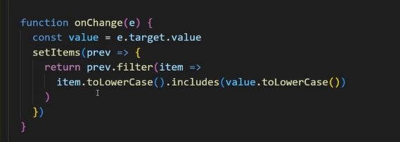
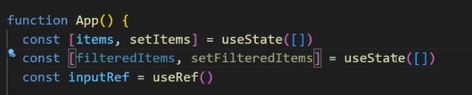
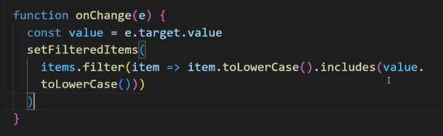
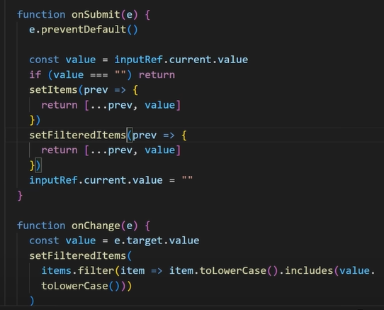

# Search Filter

📆 2022. 10. 20. 목요일

[📙 Tutorial : Most Beginner React Developers Do This Wrong](https://youtu.be/E1cklb4aeXA)

<br>

## Naive Filtering Approach 1

- 필터링된 목록이 기존 목록을 덮어씌움
  <br>
  <br>
  

<br>

## Naive Filtering Approach 2

- 원래 목록, 필터링된 목록 2가지 상태를 관리해야함
  <br>
  <br>
  
  
  

<br>

## Correct Filtering Approach

```javascript
const [items, setItems] = useState([]);
const [query, setQuery] = useState("");
const inputRef = useRef();

const filteredItems = useMemo(() => {
  return items.filter((item) => {
    return item.toLowerCase().includes(query.toLowerCase());
  });
}, [items, query]);

const onSubmit = (e) => {
  e.preventDefault();
  const newItem = inputRef.current.value;
  if (newItem === "") return;
  setItems((prev) => [...prev, newItem]);
  inputRef.current.value = "";
};

const onChange = (e) => {
  setQuery(e.target.value);
};
```

- <b>derived state 개념</b>
  - 영어라서 잘 이해 못했음... 좀 더 공부해야함
- <b>useRef</b>
  - input 요소에 접근하여 value 값 획득
- <b>toLowerCase()</b>
  - items, query 입력값을 소문자로 변환
- <b>includes()</b>
  - items 배열이 query를 포함하는지 판별
- <b>filter()</b>
  - query를 포함하는 item을 모아 새로운 배열로 반환
- <b>useMemo</b>
  - dependency에 items, query 추가하여 items, query가 바뀔 때만 필터링 목록 렌더링
  - query가 없을 때에는 필터링 하지 않도록 useMemo 코드 수정
  - 댓글에는 if(!query) return items 라고 되어 있었는데, query 값이 숫자 0인 경우 if문을 만족하게 되므로 if(query==="")이라고 쓰는게 좋을 것 같다.
